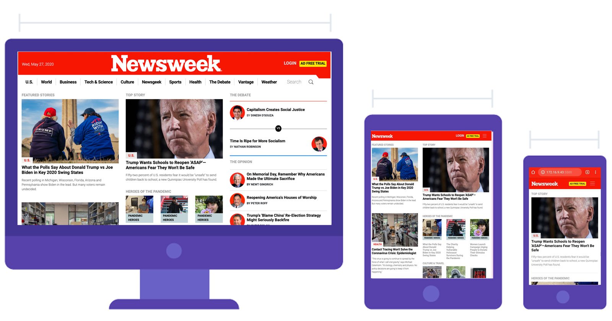

# Newsweek

In this project, Twitter’s Bootstrap framework was used to clone the [NewsWeek.com](https://www.newsweek.com/) website.

> In the course of working in this project, the following concepts were mastered

- Bootstrap v4.0 Grid Layout
- Flex order class
- Some CSS Advanced Selectors
- Bootstrap classes that change base on screen sizes. (`col-sm`, `col-md`, `col-lg`, and `col-xl`)
- Got a deeper look into the bootstrap v4 documentation.

> I learned a lot in the course of building this project.

> The mobile-first-approach was taken to tackle the design.



## Built With

- HTML
- CSS
- Twitter’s Bootstrap framework
- Stickler for CSS validation
- FontAwesome

## Live Demo

[Live Demo Link](https://acushlakoncept.github.io/newsweek/)

## Getting Started

To get a local copy of the repository please run the following commands on your terminal:

```
$ cd <folder>
```

```
$ git clone https://github.com/acushlakoncept/newsweek.git
```

## Future Implementations

> Making the mobile menu functional

> Implementing the sticky columns on scroll.

## Authors

**Uduak Essien**

- Github: [@acushlakoncept](https://github.com/acushlakoncept/)
- Twitter: [@acushlakoncept](https://twitter.com/acushlakoncept)
- Linkedin: [acushlakoncept](https://www.linkedin.com/in/acushlakoncept/)

## 🤝 Contributing

Contributions, issues and feature requests are welcome!

Feel free to check the [issues page](https://github.com/acushlakoncept/newsweek/issues).

## Show your support

Give a ⭐️ if you like this project!

## Acknowledgments

- Project originally taken from The Odin Project
- Project inspired by Microverse Program
